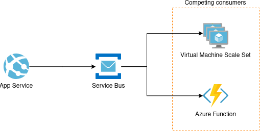

Summary
=======

Reliable messaging and pub/sub.

SLA
---

99.9%

Features
--------

  * See summary for feature comparison

High availability
-----------------

Disaster recovery
-----------------

  * RPO:
  * RTO:

SDK
---

Templates
---------

  * ARM
  * Terraform
  * Management REST API

Use cases
---------

__Service Bus__ can be used as a reliable asyncronous messaging system between front end and back end applications.

A front end pushes a lightweight message into a Service Bus queue requesting some processing, potentially writing data to process to a database before and including only a reference into the message.

The back end will pick up the message, read the data from the data store using the reference in the message and run a heavier workload; the front end then can be updated on the status polling the database for updates or passively receiving notifications from notification hubs (E.G. __Azure SignalR__).

This asyncronous pattern is common to perform intensive work and offload it from the front end.

The __Service Bus queue__ can serve multiple competing consumers, allowing to scale out the workers feeding from the same queue; if the queue size increases, more consumers can be deployed to empty it out in a timely fashion.

An efficient consumer could be an Azure Function on a consumption plan, set to use a __Service Bus trigger__; this will allow to automatically deploy consumers on demand to handle the queue workload and seamlessly scale down to zero when there are no messages to process.

Performances
------------

Scaling
-------

  * Out
  * Up

Logging
-------

Authentication, RBAC and identity
---------------------------------

RSS feed of Service Bus
https://azurecomcdn.azureedge.net/en-gb/blog/tag/service-bus/feed/

Date of last page update
12/10/2019

